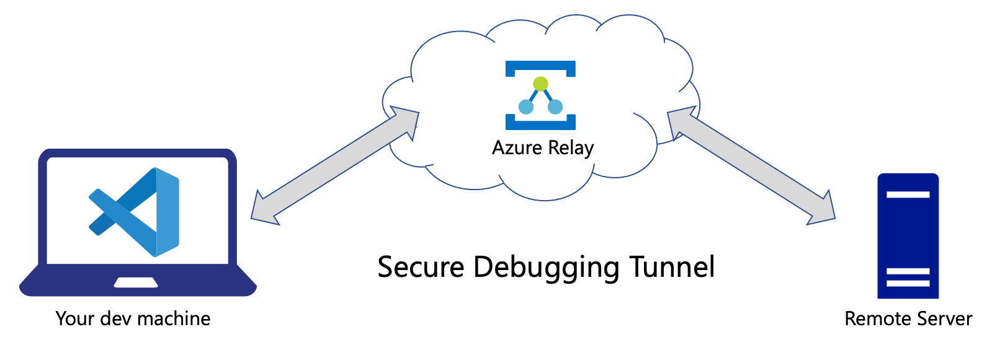

# Azure Debug Relay for Python

AzDebugRelay - a Python module for cross-network remote debugging in [Visual Studio Code](https://code.visualstudio.com/).

AzDebugRelay uses [debugpy](https://github.com/microsoft/debugpy) and [Azure Relay](https://docs.microsoft.com/en-us/azure/azure-relay/relay-what-is-it) service to create a debugging tunnel between 2 machines:

1. You local Visual Studio Code debugger in `listen` mode.
1. You remote code in `attach` mode.

Both machines can be isolated behind NAT or virtual networks - all they need is to be able to connect to Azure Relay resource.
Azure Relay carries a secure tunnel, just as if these machines were in the same VPN.



The debugging tunnel is handled by [Azure Relay Bridge](https://github.com/vladkol/azure-relay-bridge) utility which is downloaded and installed automatically by AzDebugRelay. Azure Relay Bridge can maintain secure TCP and UDP tunnels for different purposes.
AzDebugRelay is a collection of helpers for VS Code and Python that makes easier to use Azure Relay Bridge for debugging remote code.

> We currently use a private fork of [Azure Relay Bridge](https://github.com/Azure/azure-relay-bridge) repo.

## Requirements

* Python 3.6+
* debugpy

Azure Relay Bridge tool is a .NET Core application, so you may need  to install `apt-transport-https` and other .NET Core 3.1 Runtime prerequisites on [Linux](https://docs.microsoft.com/en-us/dotnet/core/install/linux) and [Windows](https://docs.microsoft.com/en-us/dotnet/core/install/windows?tabs=netcore31).

> You don't have to install .NET Runtime itself - Azure Relay Bridge build are self-contained.

### Supported Operating Systems

* Ubuntu 18+
* Debian 10+
* macOS 10+
* Windows 10

## Usage

Before you start debugging with AzDebugRelay, there are 3 places you configure it:

1. Azure Portal.
1. Local machine where you run Visual Studio Code and its Python debugger.
1. Remote machine where you run the same code files that open locally in VS Code.

### In Azure Portal

1. [Create Azure Relay resource](https://ms.portal.azure.com/#create/Microsoft.Relay). Better make one in a region closest to your location.
1. Once created, switch to the resource, and select `Hybrid Connections` option in the vertical panel.
1. Add a hybrid connection (`+ Hybrid Connection` button), give it a memorable name (e.g. `test` 🙂) - this is your **Relay Name**.
1. Switch to that new hybrid connection, then select `Shared Access Policies` in the vertical panel.
1. Add a new policy with `Send` and `Listen` permissions.
1. Once created, copy its `Primary Connection String`, this is your **Connection String**.

Every debug session requires a separate hybrid connection. Once a session is over, that hybrid connection can be used for another one.

### Locally and Remotely

Create `azrelay.json` file in your workspace directory or whatever directory will be "current" (next to `remote_server_demo.py` files),
and set 2 variables:

1. `AZRELAY_CONNECTION_STRING` to your **Connection String**.
1. `AZRELAY_NAME` to your **Relay Name**.

For example:

```json
{
  "AZRELAY_CONNECTION_STRING": "Endpoint=sb://vladkol-relay.servicebus.windows.net/;SharedAccessKeyName=default;SharedAccessKey=REDACTED;EntityPath=test",
  "AZRELAY_NAME": "test"
}
```

`azrelay.json` is added in `.gitignore`, and won't be committed.

> Alternatively, you can assign these 2 variables as environment variables.

### Locally in Visual Studio Code

This step must be done before launching the remote code.

1. Open `remote_server_demo.py` and put a breakpoint in `do_work()` function.
1. Start debugging in your local Visual Studio Code in `Python: Listen` configuration.

If you are doing this on tops of your own code:

1. Configure `.vscode/tasks.json` with `azrelaybridge-listen` and `azrelaybridge-stop` tasks as in this repo's `.vscode/tasks.json`.
1. Configure `.vscode/launch.json` with `Python: Listen` configuration as in this repo's `.vscode/launch.json`.

Notice how the debugger maps paths on the local and the remote machines.
If your code has a different structure remotely, you may need to provide more sophisticated path mappings. Here is that piece in `.vscode/launch.json`:

```json
"pathMappings": [
    {
        "localRoot": "${workspaceFolder}",
        "remoteRoot": "."
    }
]
```

It tells VS Code that the workspace directory locally is mapped to the "current" directory remotely. 

When the debugger looks goes through a file remotely, it needs to find the corresponding file in your local VS Code workspace.
When debugging `remote_server_demo.py`, the debugger maps `./remote_server_demo.py` remotely to `${workspaceFolder}/remote_server_demo.py` locally.

### Remote Machine

1. Clone the repo.
1. Start `python3 remote_server_demo.py --debug=attach`.

> Terminal session you start #2 in must have the repo's directory as current directory - for a reason of mapping local and remote directories.

If everything works as it's supposed to, you will hit a breakpoint in your local Visual Studio Code.

## AzDebugRelay API

`remote_server_demo.py` shows how you can use AzDebugRelay with your code.

**azdebugrelay** package contains DebugRelay class that install and launches Azure Relay Bridge:

```python
from azdebugrelay import DebugRelay, DebugMode

access_key_or_connection_string = "AZURE RELAY HYBRID CONNECTION STRING OR ACCESS KEY"
relay_name = "RELAY NAME" # your Hybrid Connection name
debug_mode = DebugMode.Connect # or DebugMode.WaitForConnection if connecting from another end
hybrid_connection_url = "HYBRID CONNECTION URL" # can be None if access_key_or_connection_string is a connection string
port = 5678 # any available port that you can use within your machine

debug_relay = DebugRelay(access_key_or_connection_string, relay_name, debug_mode, hybrid_connection_url, port)
debug_relay.open()

# attach to a remote debugger (usually from remote server code) with debug_mode = DebugMode.Connect
debugpy.connect(("127.0.0.1", port))

# Debug, debug, debug
# ...
# ...

debug_relay.close()
```

* `access_key_or_connection_string` - SAS Policy key or Connection String for Azure Relay Hybrid Connection. Must have `Send` and `Listen` permissions
* `relay_name` - name of the Hybrid Connection
* `debug_mode` - debug connection mode. `DebugMode.WaitForConnection` when starting in listening mode, `DebugMode.Connect` for attaching to a remote debugger.
* `hybrid_connection_url` - Hybrid Connection URL. Required when access_key_or_connection_string as an access key, otherwise is ignored and may be None.
* `port` - debugging port, `5678` by default

## Troubleshooting

### Known issues

> **On macOS, there may be a situation when Azure Relay Bridge (`azbridge`) cannot connect when creating a local forwarder** (`-L` option).

**Reason**: .NET Core wants you to add your Computer Name to `/etc/hosts` file.

**Workaround**: Make necessary edits of `/etc/hosts` file:

1. Look for your computer's name in `Settings → Sharing`.
2. Open `/etc/hosts` in a text editor in *sudo* mode (VS Code can save it later in *sudo* mode).
3. Add the following line (**replace `your-computer-name` with your computer's name**). Save the file.

```text
127.0.0.1   your-computer-name
```

> **I launched the debugger as described and nothing happened**

**Reason**: you *probably* didn't put a breakpoint in your VS Code locally. Make sure that breakpoint is in a place that your server process actually runs through.

> **I do everything right, but thing works**

**Reason**: Stop all debugging sessions (if any). Kill all `azbridge` processes. Try again.

Doesn't help? [File an issue](issues/new)! Thank you!
